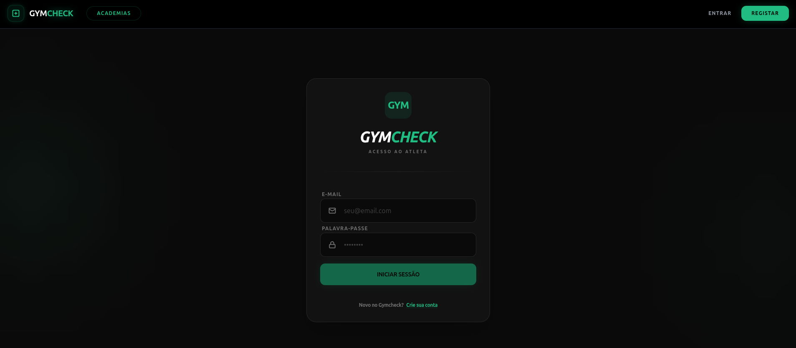
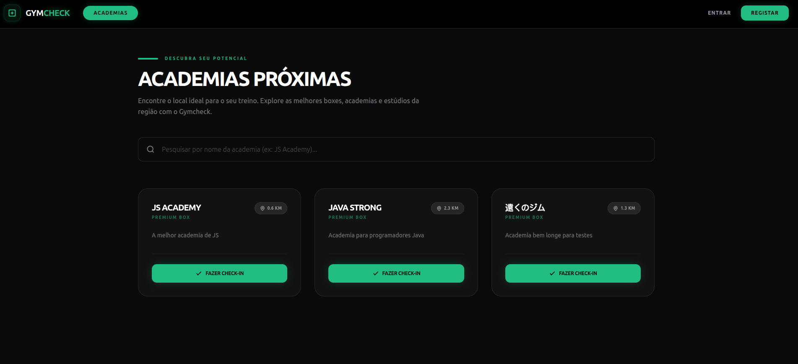
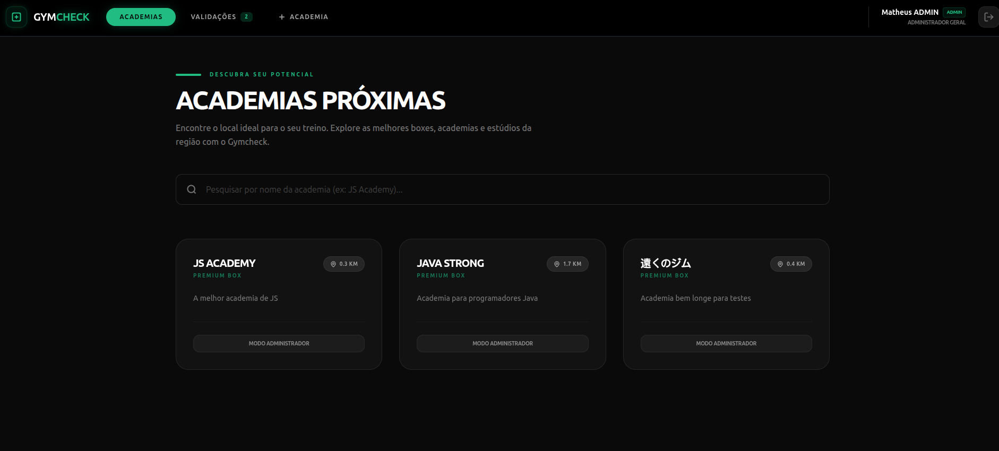
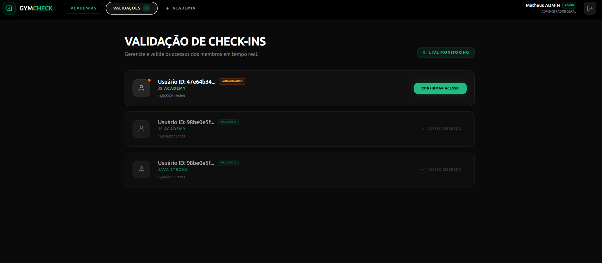
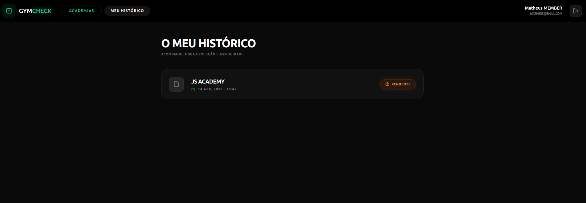
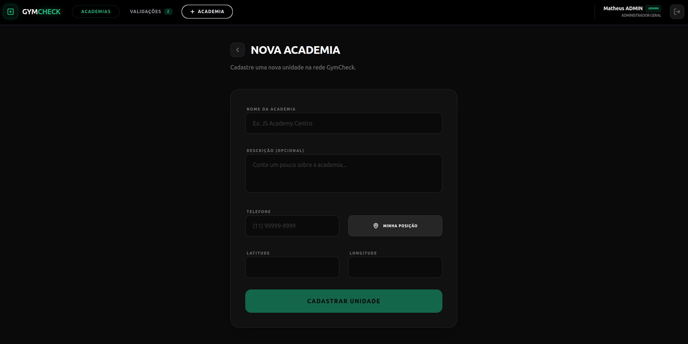

# GymCheck 🏋️‍♂️

O **GymCheck** é uma plataforma robusta inspirada no Gympass, projetada para conectar usuários a academias e gerenciar o fluxo de check-ins de forma eficiente. O sistema oferece uma experiência completa tanto para alunos, que buscam praticidade em sua rotina de treinos, quanto para administradores, que necessitam de ferramentas de gestão sólidas.

---

## 📸 Preview da Aplicação

Consulte abaixo o visual premium desenvolvido para a plataforma:

<div align="center">
  
  
</div>

<br>

<div align="center">
  
  
</div>

<br>

<div align="center">
  
  
</div>

---

## ✨ Funcionalidades

- **🔐 Autenticação Segura**: Gerenciamento de perfis (Usuário/Academia/Admin) com autenticação baseada em JWT.
- **📍 Busca por Proximidade**: Encontre academias próximas à sua localização atual.
- **✅ Sistema de Check-in**: Realize check-ins diários em qualquer academia da rede.
- **📜 Histórico Dinâmico**: Acompanhe sua evolução e frequência através de um histórico detalhado.
- **🏗️ Gestão de Unidades**: Cadastre novas academias com localização geográfica precisa.
- **🛡️ Painel Administrativo**: Interface exclusiva para validação de check-ins e gestão de alunos.
- **⚡ Performance Premium**: UI/UX fluida com micro-animações e design moderno.

---

## 🛠️ Tecnologias e Arquitetura

O projeto foi construído utilizando as tecnologias mais modernas do mercado, focando em escalabilidade e manutenção.

### 💻 Front-end
- **Framework**: [Angular 20](https://angular.dev/)
- **Linguagem**: TypeScript
- **Estilização**: Tailwind CSS v4 & Vanilla CSS
- **Chamadas de API**: Ky (Service-oriented)
- **Arquitetura**: Component-Based Architecture com forte separação de responsabilidades (Container/Presentational pattern).

### 🖥️ Back-end
- **Linguagem**: [Java 21](https://www.oracle.com/java/)
- **Framework**: Spring Boot 3
- **Segurança**: Spring Security & JWT (auth0)
- **Persistência**: Spring Data JPA & Hibernate
- **Banco de Dados**: PostgreSQL (Produção) / H2 (Desenvolvimento/Testes)
- **Migrações**: Flyway
- **Documentação**: SpringDoc OpenAPI (Swagger)
- **Arquitetura**: **Clean Architecture** com foco no padrão **Use Case** para desacoplamento total das regras de negócio.

---

## 🚀 Como Executar o Projeto

Siga os passos abaixo para rodar o ecossistema completo localmente:

### 1. Requisitos Prévios
- Java 21+ instalado.
- Node.js & NPM instalados.
- Maven.

### 2. Configurando o Back-end (API)
```bash
# Navegue até a pasta da API
cd api

# Instale as dependências
mvn clean install

# Inicie a aplicação
mvn spring-boot:run
```
*A API estará disponível em `http://localhost:8080`*

### 3. Configurando o Front-end (Web)
```bash
# Navegue até a pasta web
cd web

# Instale as dependências
npm install

# Inicie o servidor de desenvolvimento
npm run start
```
*O frontend estará disponível em `http://localhost:4200`*

---

<div align="center">
  <p>Desenvolvido por <strong>Matheus Torres</strong></p>
</div>
